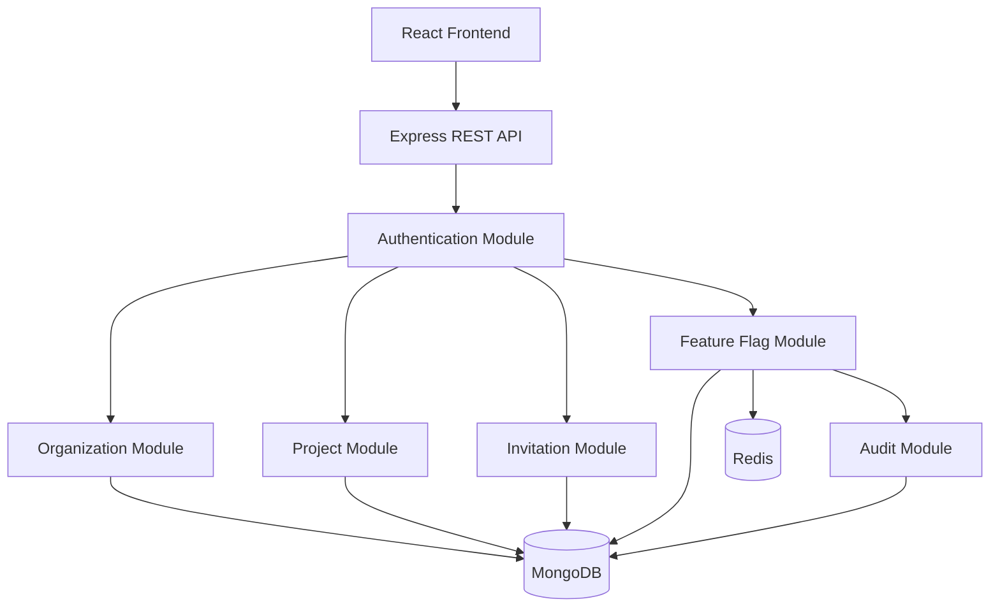

# High Level Design (HLD)

## Architecture Style

The Smart Feature Release Management System follows a **Modular Monolith Architecture**.

Reasons:

- Easier to develop and debug.
- Clear separation of modules.
- Faster deployment.
- Can be migrated to microservices in the future.

---

## High Level Architecture



---

## Request Flow

Every request follows:

```

Client
↓
Route
↓
Authentication Middleware
↓
Authorization Middleware
↓
Validation
↓
Controller
↓
Service
↓
Repository
↓
MongoDB
↓
Redis
↓
Response

```

---

## Design Principles

### Single Responsibility Principle

Every module has exactly one responsibility.

### MongoDB is Source of Truth

Permanent data is always stored in MongoDB.

### Redis is Cache Only

Redis stores frequently accessed feature configurations.

### Repository Pattern

Business logic and database logic remain separated.

### Authentication First

Every protected API passes through JWT middleware.
